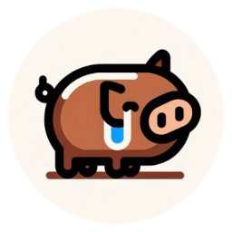

# RShiGG
A Rust reimplementation of ShiGG



## What is?

A grug-brain gui library for games.
Based on ShiGG in python (https://github.com/wegfawefgawefg/shigg).


## Why?

Sometimes you just need to slap some buttons down, and this is the tool for that.

## How do?


### 1. Define Some Tags

Tags are attached to events that are triggered by interacting with gui elements.


```python
class TopLevel(Enum):
    Settings = auto()
    SetVolume = auto()

# numpad example
class NumPad(Enum):
    One = auto()
    Two = auto()
    Three = auto()
    Four = auto()
    Five = auto()
    Six = auto()
    Seven = auto()
    Eight = auto()
    Nine = auto()
```

If you put set a buttons tag to be TopLevel.Settings, the corresponding ButtonPressed or ButtonReleased events will have that tag attached to them. 


### 2. Define Some Elements

Make your Gui object and add some elements to it.

```python

gui = Gui()

# add settings button
gui.add_button(
    Button(
        glm.vec2(0.1, 0.1), # position
        glm.vec2(0.1, 0.1), # scale
        color=(200, 200, 200), # color if you want
        image=assets.get(Icons.gear), # icon if you want
        released_tag=TopLevel.Settings, # event tag
    )
)


# add volume slider
gui.add_slider(
    Slider(
        glm.vec2(0.1, 0.25),
        glm.vec2(0.3, 0.1),
        0.05, # thumb width
        0, # min value
        100, # max value
        1, # step size
        50, # starting value
        color=(200, 200, 200),
        released_tag=TopLevel.SetVolume,
    )
)
```

### 3. Step The Gui

The gui object needs the mouse position and mouse button state to update.
For a game do that once a frame in the game loop.


```python
def normalized_mouse_pos():
    return glm.vec2(pygame.mouse.get_pos()) / window_size

mouse_pressed = pygame.mouse.get_pressed()[0] # pygame example
nmp = normalized_mouse_pos()
gui.step(nmp, mouse_pressed, render_resolution)
```

The mouse position needs to be normalized to the area the gui is in.
So if your gui is defined relative to the whole window, your mouse position should be normalized to the whole window.
If your gui is just on the right side of the screen, your mouse position should be normalized to the right side of the screen. (If its to the left of the center, the x value will be negative.)

A handy utility function is included in the libray for this. 
```python
from shigg import transform_mouse_to_normalized_subsurface_coords
nmp = normalized_mouse_pos()

# getting the normalized mouse position for a gui on the left 30% of the screen
ui_mp = transform_mouse_to_normalized_subsurface_coords(
    nmp, render_resolution, ui_position, ui_resolution
)

# getting the normalized mouse position for a gui on the right 60% of the screen
preview_mp = transform_mouse_to_normalized_subsurface_coords(
    nmp, render_resolution, preview_pos, preview_resolution
)
`````

### 4. Get Your Events

Events are triggered by interacting with gui elements.
You can see the event types on any of the element definitions in the elements [elements](shigg/elements) folder. Example: [Button](shigg/elements/button.py) Right around the top.

The tag you passed in when you defined the element will be attached to the event.
Iterate through the events and the rest is up to you. The queue is cleared after you get them.

```python
for event in gui.get_events():
    print(f"event: {event}")
    print(f"event.tag: {event.tag}")

    if event.tag == TopLevel.Settings:
        pause_game()
        open_settings()
    elif event.tag == TopLevel.SetVolume and isinstance(event, SliderReleased):
        set_volume(event.value)
```

### 5. Draw The Gui
The gui has default drawing functions for every element.
Right now only for pygame, because I think thats 99% of game dev in python.
These take in a target pygame surface and a resolution.

```python
# drawing
render_surface.fill((60, 60, 60))
gui.draw(render_surface, render_resolution)
pygame.display.flip()
    
```

If you want to make your own theme, you can override the draw function on the gui object.
Go check out the default drawing code in [pygame.py](shigg/default_drawing/pygame.py) to see how it works.
Its not that complicated; some colored rectangles and text labels, and the elements darken / shift around a little bit when clicked.

### Installation

1. Install

   ```bash
   pip install shigg
   ```

2. Import

   ```python
   from shigg import Gui, Button, Slider # and whatever other elements you want
   ```

## Fancy Features: I Want Submenus, and Groups, and Guis that move around.

### Groups
If you need groups, just make a gui object for each group. You can have as many as you want. 

### Submenus, and Guis that move around
If you need an animated submenu or floating menu, or just appearing or dissapearing you can do that too. Make a gui for your submenu.
When you draw it, pass in the resolution of the area you want it to be in. If you need to position it to a sub portion of the screen, make a new surface for your submenu, blit it to a surface and then blit that surface to the screen at the position you want. I think thats usually how this works in game engines anyways, lets you do effects at composite time. (Like a drop shadow for example by first rendering a grey rectangle under the submenu surface with an offset.)

Rendering a submenu might look something like this:

```python
# init
window_surface = pygame.display.get_surface()

# ...
# define your main gui, and submenu gui
# define your submenu gui
# ...

main_gui,draw(window_surface, window_surface.get_size())
if inventory_open:
    repopulate_inventory_gui(inventory_gui)
    inventory_surface = pygame.Surface(200, 200)
    inventory_gui.draw(inventory_surface, (200, 200)) # draws the gui to the inventory surface
window_surface.blit(inventory_surface, (100, 100)) # draws the inventory surface at 100,100
```

You can blit the inventory surface wherever you want, so if you need sliding animations or want it moving around, just change the position you blit it to.

I've got a submenu that opens up when you press a button, and hides when you select food in the example [example.py](example/example.py). It's not fancy.

### Custom Elements
You probably wont need to do this. At that point you need to read how the other elements are defined and do the same thing. 
Composite elements comprised of other elements that need to react to external events are Guis. 
So if you're trying to make reactive state across elements, you should probably make another Gui object, 
and just put the logic in the event loop.

But if you want to make a custom element that consumes internal events, and then put in your other Guis, you can do that. 
```python
from shigg import Element, ElementEvent
class MyCustomElement(Element):
    pass
```


If you made a custom element you'll want to add a custom draw function for it, or it cant be drawn.
```python
gui.draw_kit["MyCustomElement"] = my_custom_draw_function
```

### It doesnt use a fancy data structure for optimizing mouse detection.
How many buttons do you have, what the fuck? You should't need more than 20.
Maybe I'll get SID / tree in there that you can toggle on if you have too many.

### I don't want to handle all my gui objects seperately.

This is supposed to be simple. I don't want to have element group heirarchies, and do tree traversal for rendering, and then you need callbacks, and rebuild the most related parent per update. etc. 
This isnt a web browser. This is not HTML.

Think like Grug. If you have a bunch of guis, put em in a list.
Try this:

```python
    guis = [main_menu, submenu, stats] # your guis
    if inventory_open:
        guis.append(inventory_gui)
    for gui in guis:
        gui.step(mouse_pos, etc...)
    
    # and for events
    all_events = [obj.get_events() for obj in guis]
    for event in itertools.chain(*all_events):
        # etc ...
```

Personally I don't want to have a giant match case where I handle every single gui event in the same place. Handling inventory events in a seperate loop from the other menus is nice. 
Idk, maybe you are higher IQ than me and want this.

### I want a gamepad button or keypress to trigger an event too.

This is still in consideration. 
Theres no mapping of id to elements or something that enables you to animate them pressing without 
actually pressing them with the mouse. like button.press() or something.

For now just hide or show menus when you get an event that should do so.
If you are a horrible person make a virtual mouse and move it around with the gamepad, click with a button.

I think a graph of keypoints that can be stepped through with the gamepad, 
and then the current keypoint is a fixed virtual mouse is the way to go. 
Maybe Ill make a seperate library for that.
